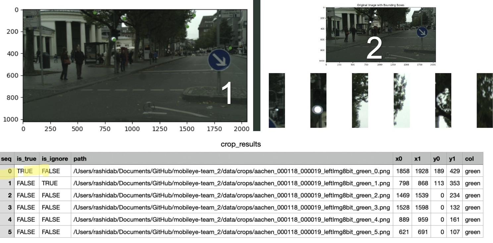
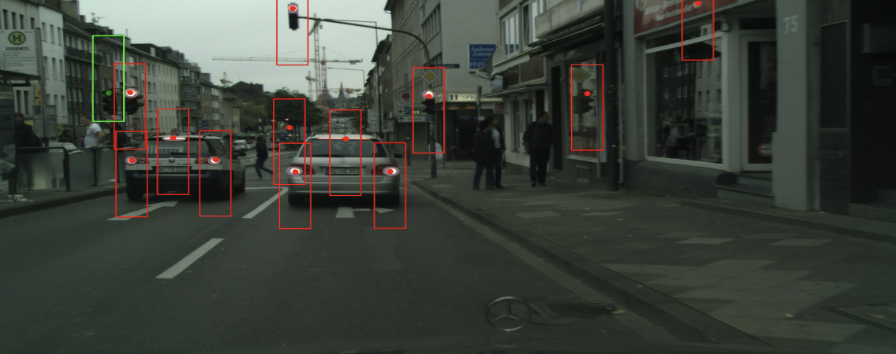
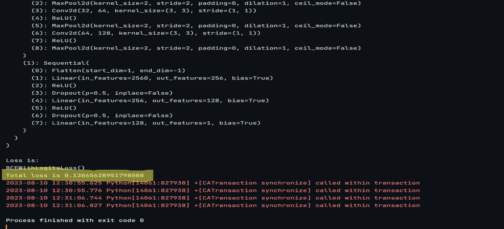

# Traffic Light Detection Project
### Mobileye project in collaboration with Scale-Up Velocity

This project, undertaken by the company Mobily in cooperation with Scale-Up Velocity, was a part of the Scale-Up Bootcamp conducted from August to July 2023. The project focused on learning and independently implementing image processing techniques, advanced Python programming, teamwork, and more.

The primary goal of this project was traffic light detection using image processing techniques and neural networks.

## Table of Contents

- [About](#about)
- [Workflow](#workflow)
- [Installation](#Installation)
- [Usage](#usage)
- [License](#license)
- [Additional Information](#additional-information)
- [Acknowledgments](#acknowledgments)

## Workflow

The workflow begins with a high-pass filter convolution for image enhancement and a conversion to the HSV color space. After this step, red and green filters are applied to isolate potential traffic lights, resulting in crops of the suspected traffic lights. These cropped images are then provided as input to the neural network for classification. The primary purpose of the neural network is to determine if these isolated regions indeed represent traffic lights, making it a pivotal component of the traffic light detection process.

## Installation

Please note that this project requires a specific dataset that is not included in this repository due to size constraints, access limitations and privacy of the company. As a result, installation alone won't enable the project to run independently. 

To explore the code structure, configurations, or view the implementation details, navigate through the respective files. For a demonstration or understanding of the workflow, refer to the attached presentation named final_presentation.pptx.

## Usage

This project is divided into two parts:

### Part 1: Pre-study of the Machine (part_1.py)

The `part_1.py`  initiates the workflow by first applying a high-pass filter convolution for image enhancement, enhancing the image quality. Subsequently, the images undergo a transformation to the HSV color space. Red and green filters are then selectively applied to detect and isolate potential traffic lights within the images. This step results in the extraction of precise crops containing the suspected traffic lights.

These cropped images, now containing isolated regions potentially representing traffic lights, serve as input for the neural network. The neural network's primary task within this phase is to classify these isolated regions, determining if they genuinely depict traffic lights. This classification process stands as a pivotal component within the traffic light detection mechanism.

**Part 1 Code Preview**

### Part 2: Learning Machine (code1.py)

The `code1.py` contains the code for the learning machine using the CSV file of the dataset. 

## Additional Information

For additional images, detailed explanations of our code, and to see the results in action, please refer to the attached presentation named final_presentation.pptx.

## Acknowledgments

#### Company:
We extend our gratitude to Mobily for their support, resources, and guidance throughout the development of this project.

#### Scale-Up Bootcamp:
This project was made possible by the invaluable insights, mentorship, and learning opportunities provided by the Scale-Up Bootcamp. 

#### Project Partners:
We would like to thank our project partners Abo Unis Rashid and Heller Yehuda for their collaboration, expertise, and contributions, which significantly enriched the outcome of this project.